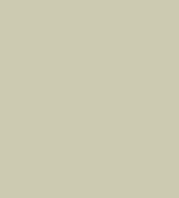

# project1
Blogging Website for poetry. 
### Color pallet to be followed
You have to stick to the given color pallet, but in case if it is very neccesary you can use a different color but that to should be of the same color tone.
1. #DB586F 
2. #972B4E 
3. #9E3C8F 
4. #15132F 
5. #3D9D8A 
6. #335448 
7. #CDC7B2 
8. #AAE30E 

### Tech Stack Used 
1. HTML
2. CSS
3. Java Script
